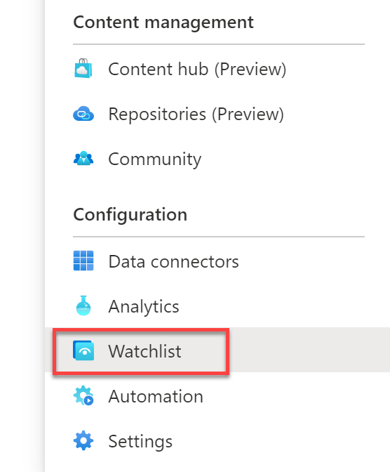
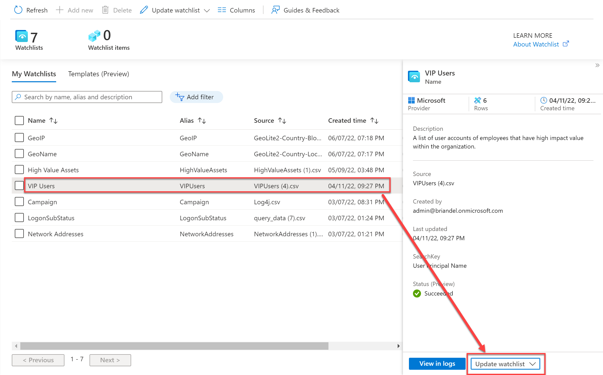
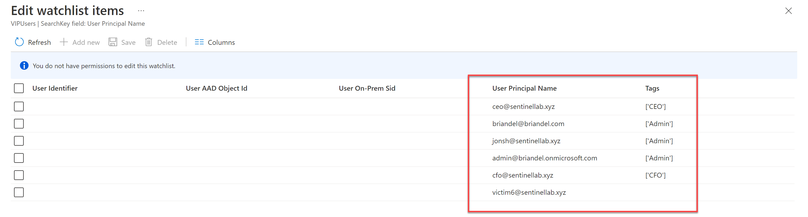
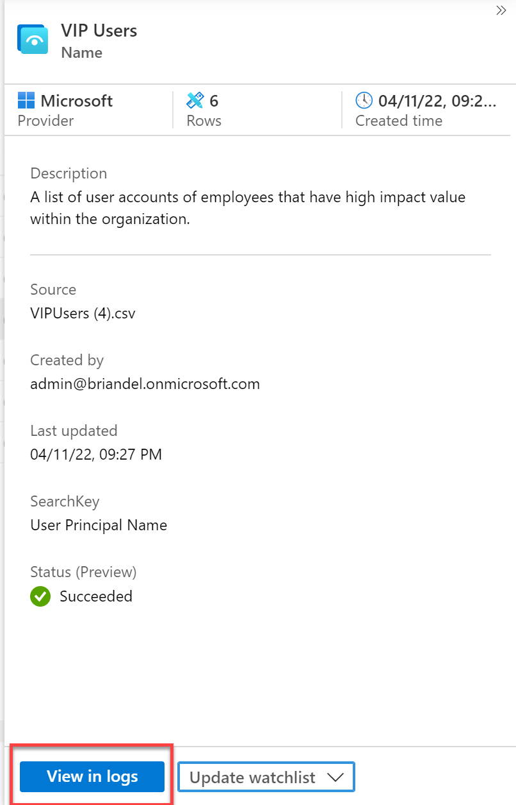
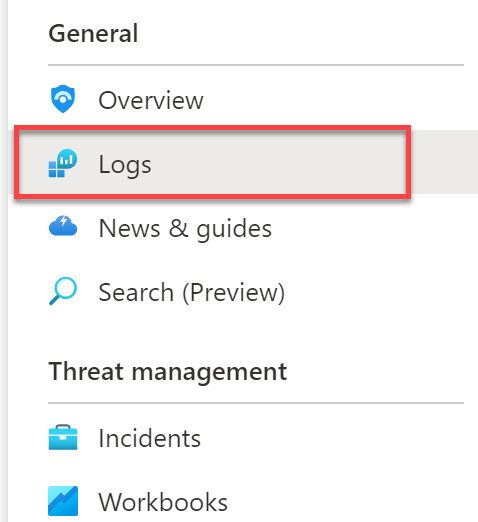
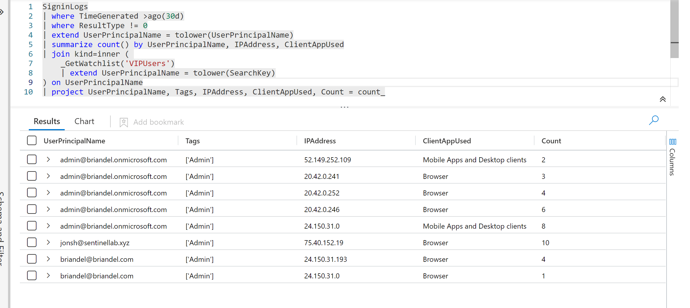

## Exercise 5: Using Watchlist. <br>
In this lab we will review a watchlist and use it to enrich hunting with buisness knowledge <br>

**Task 1:** Review a Watchlist <br>

1. Navigate to Sentinel and Select **Watchlist** in the Taskbar


<br>
  
2. Here you can see all the watchlist that have already been created. You do not have permissions in this environment to create new watchlist. Select **VIP Users** watchlist, then **Update watchlist** then **Edit watchlist items**


<br>

3. On this screen, you will see a banner message stating *You do not have permissions to edit this watchlist*. However you can review the table and see that some of the columns are populated with buisness data, in this example, titles of various users.


<br>

4. Navigate back to the previous screen and select **View in Logs**


<br>

5. Now you can see the same data, with additional metadata within the results 

**Task 2:** Enrich Queries with Watchlist data

1. From the Microsoft Sentinel navigation pane, select **Logs**


<br>

2. Type or paste in the following query, then press **Run**

```powershell
SigninLogs
| where TimeGenerated >ago(30d)
| where ResultType != 0
| extend UserPrincipalName = tolower(UserPrincipalName)
| summarize count() by UserPrincipalName, IPAddress, ClientAppUsed
| join kind=inner ( 
    _GetWatchlist('VIPUsers')
    | extend UserPrincipalName = tolower(SearchKey)
) on UserPrincipalName
| project UserPrincipalName, Tags, IPAddress, ClientAppUsed, Count = count_
```
3. This query has used a join to combine data from the SigninLogs table and data from the VIPUsers watchlist. This data can be used just like any other data in Log Analytics, allowing you to perform further filters, summarizations and more.
 

<br>